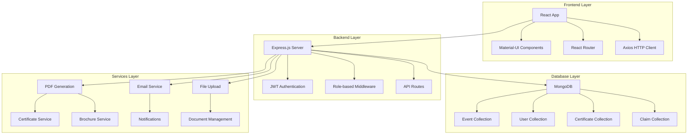
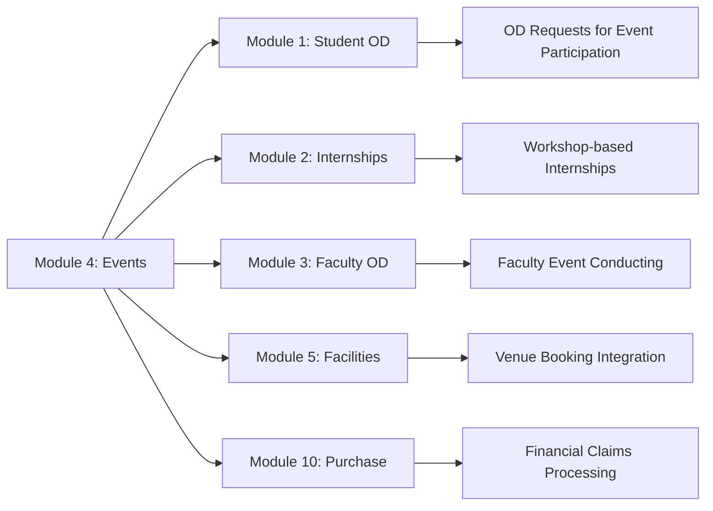

# 🎓 Events Management Application

<div align="center">


**A comprehensive web application for managing educational events, training programs, workshops, and certificate courses at Anna University**

[](https://opensource.org/licenses/ISC)
[](https://nodejs.org/)
[](https://reactjs.org/)
[](https://www.mongodb.com/)

[🚀 Quick Start](#-quick-start) • [📖 Documentation](#-api-documentation) • [🤝 Contributing](#-contributing) • [📞 Support](#-support)

</div>

---

## 📋 Table of Contents

- [🌟 Features](#-features)
- [🏗️ System Architecture](#️-system-architecture)
- [🛠️ Technology Stack](#️-technology-stack)
- [🚀 Quick Start](#-quick-start)
- [📁 Project Structure](#-project-structure)
- [📖 API Documentation](#-api-documentation)
- [🎨 Module 4: Events Management](#-module-4-events-management)
- [🔧 Development Guide](#-development-guide)
- [🧪 Testing](#-testing)
- [🚀 Deployment](#-deployment)
- [🤝 Contributing](#-contributing)
- [📄 License](#-license)

---

## 🌟 Features

### 🏢 **Multi-Role System with Advanced Permissions**
- **👨‍💼 HOD (Head of Department)**: 
  - Create and approve events
  - Manage organizing committees
  - View department-wide analytics
  - Download claim PDFs and reports
  - Add approval comments
- **👨‍🏫 Coordinator**: 
  - Manage assigned events
  - Generate professional brochures
  - Handle participant registrations
  - Process claims and budgets
  - Generate certificates
  - Manage feedback statistics
- **👨‍🎓 Participant**: 
  - Register for events
  - View certificates
  - Provide feedback
  - Track completed events
- **🔧 Admin**: 
  - Manage feedback questions
  - System-wide configuration
  - User role management

### 📋 **Comprehensive Event Management**
- **🎯 Dynamic Event Creation**: 
  - Customizable event types (workshops, training programs, seminars, courses)
  - Comprehensive event schema with 50+ fields
  - Multi-department organizing support
  - Advanced registration procedures
- **👥 Organizing Committee Management**: 
  - Add committee members with roles and designations
  - Department-wise committee assignment
  - HOD approval workflow
- **📝 Registration System**: 
  - Flexible registration forms
  - Payment integration support
  - Evaluation criteria configuration
  - Participant limit management
- **📊 Real-time Dashboard**: 
  - Live statistics and analytics
  - Participant management
  - Event status tracking

### 📄 **Advanced Document Generation**
- **🎨 Professional Brochures**: 
  - AI-enhanced content generation
  - Anna University branding
  - Dynamic layout system
  - Multi-format export (PDF, PNG)
- **🏆 Certificate System**: 
  - Automated certificate generation
  - Bulk processing capabilities
  - QR code verification
  - Template customization
  - Download tracking
- **💰 Claim Processing**: 
  - Template-based claim generation
  - Expense categorization
  - Approval workflow
  - PDF generation with signatures
- **📋 Form Generation**: 
  - Dynamic registration forms
  - Custom field support
  - Validation rules
  - Integration with brochures

### 💰 **Financial Management**
- **📊 Budget Tracking**: 
  - Income and expense categorization
  - Real-time budget monitoring
  - University overhead calculation (30%)
  - GST handling
- **🧾 Claim Processing**: 
  - Item-wise claim management
  - Approval workflow
  - Receipt generation
  - Status tracking
- **💳 Payment Integration**: 
  - Bank account management
  - Payment details in brochures
  - Fee collection tracking

### 📊 **Analytics & Reporting**
- **📈 Event Statistics**: 
  - Participant analytics
  - Completion rates
  - Feedback scores
  - Financial summaries
- **📋 Dashboard Analytics**: 
  - Visual charts and graphs
  - Real-time data updates
  - Export capabilities
- **📄 Report Generation**: 
  - Participant lists
  - Certificate reports
  - Financial reports
  - Feedback analysis

### 🔐 **Security & Authentication**
- **🔑 JWT-based Authentication**: 
  - Secure login system
  - Token refresh mechanism
  - Session management
- **🛡️ Role-based Authorization**: 
  - Granular permissions
  - Route protection
  - API endpoint security
- **🔒 Data Protection**: 
  - Password encryption (Bcrypt)
  - Input validation
  - SQL injection prevention
  - XSS protection

## 🌟 Features

### 🏢 Multi-Role System
- **HOD (Head of Department)**: Create events, manage organizing committees, approve/reject events
- **Coordinator**: Manage assigned events, generate documents, handle participant registrations
- **Participant**: Register for events, view certificates, provide feedback

### 📋 Event Management
- **Dynamic Event Creation**: Customizable event types (workshops, training programs, seminars, courses)
- **Organizing Committee Management**: Add committee members with roles and designations
- **Registration Procedure Configuration**: Flexible registration forms, payment details, evaluation criteria
- **Event Dashboard**: Real-time statistics and participant management

### 📄 Document Generation
- **Professional Brochures**: AI-enhanced brochures with Anna University branding
- **Dynamic Content**: Auto-generated course descriptions based on event data
- **Registration Forms**: Customizable forms integrated into brochures
- **Certificate Generation**: Automated certificate generation for participants
- **PDF Management**: Save, download, and manage all generated documents

### 🎨 Brochure Features
- **Professional Layout**: Two-column design with Anna University logo and branding
- **AI-Enhanced Descriptions**: Intelligent course descriptions based on event type and content
- **Dynamic Sections**: 
  - About the University/Department
  - Event Information
  - Organizing Committee (from database)
  - Registration Information
  - Payment Details
  - Contact Information
- **Responsive Design**: Optimized for printing and digital viewing

### 🔐 Authentication & Security
- **JWT-based Authentication**: Secure login system
- **Role-based Authorization**: Different access levels for different user types
- **Password Encryption**: Bcrypt-secured password storage
- **Session Management**: Automatic token refresh and logout

### 📊 Analytics & Reporting
- **Event Statistics**: Participant counts, completion rates, feedback scores
- **Dashboard Analytics**: Visual charts and graphs using Recharts
- **Export Capabilities**: Download participant lists, certificates, and reports

---

## 🏗️ System Architecture



### **Module 4: Events Management (Current Implementation)**

This application currently implements **Module 4** of a comprehensive 10-module system:

```
📦 Complete System Architecture
├── 📋 Module 1: Student OD Request & Approval (Planned)
├── 🎓 Module 2: Student Internship Management (Planned)
├── 👨‍🏫 Module 3: Faculty OD Request & Approval (Planned)
├── 🎉 Module 4: Events Conducted by Department (✅ IMPLEMENTED)
├── 🏢 Module 5: Facility Booking System (Planned)
├── 📅 Module 6: Timetable & Workload Management (Planned)
├── 💬 Module 7: Student Course Feedback & Grievances (Planned)
├── 📊 Module 8: Project Review System (Planned)
├── 📝 Module 9: PG CS Examination Management (Planned)
└── 💰 Module 10: Purchase Committee & Claims (Planned)
```

---

## 🛠️ Technology Stack

<div align="center">

### **Frontend Technologies**
| Technology | Version | Purpose |
|------------|---------|---------|
|  | 19.1.0 | UI Framework |
|  | 7.1.1 | Component Library |
|  | Latest | Build Tool |
|  | 7.6.2 | Routing |
|  | 1.10.0 | HTTP Client |

### **Backend Technologies**
| Technology | Version | Purpose |
|------------|---------|---------|
|  | 16+ | Runtime |
|  | 5.1.0 | Web Framework |
|  | 4.4+ | Database |
|  | 8.16.1 | ODM |
|  | Latest | Authentication |

### **Additional Libraries**
| Library | Purpose |
|---------|---------|
| 📄 **PDFKit 0.17.1** | Server-side PDF generation |
| 📧 **Nodemailer 7.0.4** | Email notifications |
| 🔒 **Bcrypt 6.0.0** | Password hashing |
| 📁 **Multer 2.0.1** | File upload handling |
| 📊 **Recharts 2.15.3** | Data visualization |
| 🔔 **Notistack 3.0.2** | Toast notifications |
| 📋 **jsPDF 3.0.1** | Client-side PDF generation |

</div>

## 🚀 Quick Start

### Prerequisites
- **Node.js** (v16 or higher)
- **MongoDB** (v4.4 or higher)
- **Git**

### Installation

1. **Clone the repository**
   ```bash
   git clone https://github.com/DhanushT7/Events-Management-Application.git
   cd Events-Management-Application
   ```

2. **Install root dependencies**
   ```bash
   npm install
   ```

3. **Install Frontend dependencies**
   ```bash
   cd Frontend
   npm install
   cd ..
   ```

4. **Install Backend dependencies**
   ```bash
   cd Backend
   npm install
   cd ..
   ```

5. **Install all dependencies**
   ```bash
   npm install-all
   ```
### Configuration

1. **Backend Environment Setup**
   Create a `.env` file in the `Backend` directory:
   ```env
   PORT=5050
   MONGODB_URI=mongodb://localhost:27017/events-management
   JWT_SECRET=your-super-secret-jwt-key
   EMAIL_USER=your-email@gmail.com
   EMAIL_PASS=your-app-password
   ```

2. **Frontend Configuration**
   Update API base URL in `Frontend/src/services/api.js` if needed:
   ```javascript
   const API_BASE_URL = 'http://localhost:5050/api';
   ```

### Database Setup

1. **Start MongoDB**
   ```bash
   # For Windows (if MongoDB is installed as service)
   net start MongoDB
   
   # For macOS/Linux
   sudo systemctl start mongod
   # OR
   mongod
   ```

2. **Create Sample Data (Optional)**
   ```bash
   node create-sample-data.js
   ```

### Running the Application

#### Option 1: Run Servers Separately

**Terminal 1 - Backend Server**
```bash
npm run backend
# OR
cd Backend && npm start
```

**Terminal 2 - Frontend Development Server**
```bash
npm run frontend
# OR
cd Frontend && npm run dev
```

### Using VS Code Tasks
If using VS Code, you can use the predefined task:
```bash
# Use Ctrl+Shift+P -> "Tasks: Run Task" -> "Start Backend Server"
```

## 📱 Application Access

- **Frontend**: http://localhost:5173
- **Backend API**: http://localhost:5050
- **MongoDB**: mongodb://localhost:27017

## 👥 Default User Accounts

After running sample data creation:

### HOD Account
- **Email**: hod@annauniv.edu
- **Password**: hod123
- **Role**: Head of Department

### Coordinator Account
- **Email**: coordinator@annauniv.edu
- **Password**: coord123
- **Role**: Coordinator

### Participant Account
- **Email**: participant@annauniv.edu
- **Password**: part123
- **Role**: Participant

## 📁 Project Structure

```
Events-Management-Application/
├── Backend/                          # Backend server
│   ├── config/
│   │   └── db.js                    # Database configuration
│   ├── controllers/                 # Route controllers
│   │   ├── auth/                   # Authentication controllers
│   │   ├── coordinator/            # Coordinator-specific controllers
│   │   ├── hod/                    # HOD-specific controllers
│   │   └── participant/            # Participant-specific controllers
│   ├── middleware/                 # Custom middleware
│   ├── models/                     # MongoDB schemas
│   ├── routes/                     # API routes
│   ├── passwordManager/            # Encryption/Decryption utilities
│   ├── server.js                   # Main server file
│   └── package.json
├── Frontend/                        # React frontend
│   ├── public/                     # Static assets
│   ├── src/
│   │   ├── components/             # Reusable components
│   │   ├── context/                # React context providers
│   │   ├── pages/                  # Page components
│   │   │   ├── Auth/              # Authentication pages
│   │   │   ├── coordinator/       # Coordinator dashboard
│   │   │   ├── HOD/               # HOD dashboard
│   │   │   └── Participants/      # Participant pages
│   │   ├── services/              # API services and utilities
│   │   │   ├── api.js             # API configuration
│   │   │   └── brochureGenerator.js # Professional brochure generation
│   │   ├── styles/                # CSS stylesheets
│   │   ├── App.jsx                # Main App component
│   │   └── main.jsx               # Entry point
│   ├── package.json
│   └── vite.config.js
├── data/                           # MongoDB data files
├── create-sample-data.js           # Sample data creation script
├── package.json                    # Root package.json
└── README.md                       # This file
```

---

## 📖 API Documentation

### **Authentication Endpoints**
```http
POST /api/auth/register          # User registration
POST /api/auth/login             # User login
POST /api/auth/forgot-password   # Password reset
GET  /api/auth/verify-token      # Token verification
```

### **Admin Endpoints**
```http
GET    /api/admin/feedback-questions           # Get all feedback questions
POST   /api/admin/feedback-questions           # Create feedback question
PUT    /api/admin/feedback-questions/:id       # Update feedback question
DELETE /api/admin/feedback-questions/:id       # Delete feedback question
PUT    /api/admin/feedback-questions/reorder   # Reorder questions
POST   /api/admin/feedback-questions/initialize # Initialize default questions
```

### **HOD (Head of Department) Endpoints**
```http
GET  /api/hod/events                    # Get all events
GET  /api/hod/events/pending            # Get pending approvals
POST /api/hod/events/:id/approve        # Approve event
POST /api/hod/events/:id/reject         # Reject event
POST /api/hod/events/:id/comment        # Add approval comment
GET  /api/hod/participants/:eventId     # Get event participants
GET  /api/hod/download-claim/:eventId   # Download claim PDF
PUT  /api/hod/events/:id/status         # Update event status
```

### **Coordinator Endpoints**
```http
GET  /api/coordinator/dashboard                    # Dashboard data
GET  /api/coordinator/events                       # Get coordinator events
GET  /api/coordinator/events/:id                   # Get specific event
POST /api/coordinator/events                       # Create new event
PUT  /api/coordinator/events/:id                   # Update event
GET  /api/coordinator/participants/:eventId        # Get participants
POST /api/coordinator/participants/:eventId        # Add participant
POST /api/coordinator/brochure/:eventId           # Generate brochure
GET  /api/coordinator/brochure/:eventId           # Download brochure
POST /api/coordinator/claims/:eventId             # Submit claim
GET  /api/coordinator/claims/:eventId             # Get claim details
POST /api/coordinator/generate-claim/:eventId     # Generate claim PDF
GET  /api/coordinator/feedback-stats/:eventId     # Get feedback statistics
POST /api/coordinator/organizing-committee        # Manage committee
PUT  /api/coordinator/budget-sync/:eventId        # Sync budget data
```

### **Participant Endpoints**
```http
GET  /api/participant/dashboard              # Participant dashboard
GET  /api/participant/events                 # Available events
POST /api/participant/register/:eventId      # Register for event
GET  /api/participant/events/completed       # Completed events
POST /api/participant/feedback               # Submit feedback
GET  /api/participant/certificates           # Get certificates
```

### **Certificate Endpoints**
```http
POST /api/certificates/generate              # Generate single certificate
POST /api/certificates/bulk-generate         # Bulk generate certificates
GET  /api/certificates/:id                   # Get certificate details
GET  /api/certificates/download/:id          # Download certificate
GET  /api/certificates/verify/:id            # Verify certificate (public)
GET  /api/certificates/event/:eventId        # Get event certificates
GET  /api/certificates/participant/:userId   # Get user certificates
```

### **Claim Management Endpoints**
```http
GET    /api/claims/:eventId                  # Get event claims
POST   /api/claims/:eventId                  # Submit claim
PUT    /api/claims/:eventId/:itemId          # Update claim item
DELETE /api/claims/:eventId/:itemId          # Delete claim item
POST   /api/claims/:eventId/approve          # Approve claim
POST   /api/claims/:eventId/reject           # Reject claim
GET    /api/claims/:eventId/pdf              # Download claim PDF
```

### **Budget Sync Endpoints**
```http
GET  /api/budget-sync/:eventId               # Get budget data
POST /api/budget-sync/:eventId               # Sync budget
PUT  /api/budget-sync/:eventId               # Update budget
```

---

## 🎨 Module 4: Events Management

### **Current Implementation Features**

<div align="center">

| Feature Category | Implementation Status | Description |
|------------------|----------------------|-------------|
| 🎯 **Event Creation** | ✅ Complete | Full event lifecycle management |
| 👥 **User Management** | ✅ Complete | Multi-role authentication system |
| 📄 **Document Generation** | ✅ Complete | Brochures, certificates, claims |
| 💰 **Financial Tracking** | ✅ Complete | Budget management and claims |
| 📊 **Analytics** | ✅ Complete | Real-time dashboards and reports |
| 🔐 **Security** | ✅ Complete | JWT auth with role-based access |
| 📱 **Responsive UI** | ✅ Complete | Material-UI based interface |
| 🏆 **Certificate System** | ✅ Complete | Automated generation with QR codes |

</div>

### **Event Schema Overview**

The event model includes comprehensive fields for:

```javascript
// Key Event Fields (50+ total fields)
{
  // Basic Information
  title, startDate, endDate, venue, mode, duration, type,
  objectives, outcomes, budget, status,
  
  // Registration System
  registrationProcedure: {
    enabled, instructions, submissionMethod, deadline,
    participantLimit, selectionCriteria, confirmationDate,
    certificateRequirements, paymentDetails, registrationForm
  },
  
  // Financial Management
  budgetBreakdown: {
    income: [{ category, expectedParticipants, amount, gst }],
    expenses: [{ category, amount }],
    totalIncome, totalExpenditure, universityOverhead
  },
  
  // Claims Processing
  claimBill: {
    expenses: [{ category, budgetAmount, actualAmount, status }],
    totalBudgetAmount, totalExpenditure, status, approvedBy
  },
  
  // Multi-Department Support
  organizingDepartments: {
    primary: "DEPARTMENT OF COMPUTER SCIENCE AND ENGINEERING",
    associative: ["CENTRE FOR CYBER SECURITY (CCS)"]
  },
  
  // Approval Workflow
  departmentApprovers: [{
    department, hodName, hodDesignation, approved, approvedDate
  }],
  
  // Document Management
  brochure: { data, contentType, fileName },
  claimPDF: { data, contentType, fileName },
  brochurePDF: { data, contentType, fileName }
}
```

### **Integration Points for Future Modules**



### **Database Collections**

| Collection | Purpose | Key Features |
|------------|---------|--------------|
| 📅 **events** | Event management | 50+ fields, multi-department support |
| 👤 **users** | User authentication | Role-based permissions |
| 👥 **participants** | Participant tracking | Registration and feedback |
| 🏆 **certificates** | Certificate management | QR verification, bulk generation |
| 💰 **claims** | Financial claims | Item-wise tracking, approval workflow |
| 📝 **feedback** | Event feedback | Question bank, analytics |
| 👨‍💼 **convenorcommittees** | Committee management | Role assignments |
| 🎓 **trainingprogrammes** | Program specifics | Detailed course information |

---

## 🔧 Development Guide

### **Setting Up Development Environment**

1. **Install Required Tools**
   ```bash
   # Install Node.js (v16+)
   # Install MongoDB (v4.4+)
   # Install Git
   # Install VS Code (recommended)
   ```

2. **Clone and Setup**
   ```bash
   git clone https://github.com/DhanushT7/Events-Management-Application.git
   cd Events-Management-Application
   npm run setup  # Installs all dependencies
   ```

3. **Environment Configuration**
   ```bash
   # Backend/.env
   PORT=5000
   MONGODB_URI=mongodb://localhost:27017/events_management
   JWT_SECRET=your-super-secret-key
   NODE_ENV=development
   
   # Frontend/.env
   VITE_API_BASE_URL=http://localhost:5000/api
   VITE_APP_NAME=Events Management System
   ```

### **Development Scripts**

```bash
# Root level commands
npm run setup           # Install all dependencies
npm run dev            # Start both frontend and backend
npm run backend        # Start backend only
npm run frontend       # Start frontend only
npm run build          # Build for production
npm run test           # Run all tests
npm run clean          # Clean node_modules

# Backend specific
cd Backend
npm run dev            # Development with nodemon
npm run start          # Production start
npm run test           # Backend tests
npm run seed           # Seed database

# Frontend specific
cd Frontend
npm run dev            # Development server
npm run build          # Production build
npm run preview        # Preview production build
npm run test           # Frontend tests
```

### **Code Structure Guidelines**

#### **Backend Structure**
```
Backend/
├── controllers/
│   ├── admin/              # Admin-specific logic
│   ├── coordinator/        # Coordinator operations
│   ├── hod/               # HOD management
│   ├── participant/       # Participant features
│   └── auth/              # Authentication
├── models/                # MongoDB schemas
├── routes/                # API route definitions
├── middleware/            # Custom middleware
├── services/              # Business logic
├── utils/                 # Helper functions
└���─ config/                # Configuration files
```

#### **Frontend Structure**
```
Frontend/src/
├── components/            # Reusable UI components
├── pages/                # Page-level components
│   ├── Auth/             # Authentication pages
│   ├── coordinator/      # Coordinator dashboard
│   ├── HOD/              # HOD interface
│   └── Participants/     # Participant views
├── services/             # API integration
├── context/              # React context providers
├── hooks/                # Custom React hooks
├── utils/                # Helper functions
└── styles/               # CSS and styling
```

### **Adding New Features**

1. **Backend Feature Development**
   ```bash
   # 1. Create model (if needed)
   touch Backend/models/newFeatureModel.js
   
   # 2. Create controller
   touch Backend/controllers/newFeatureController.js
   
   # 3. Create routes
   touch Backend/routes/newFeatureRoutes.js
   
   # 4. Add to main server
   # Edit Backend/server.js to include new routes
   ```

2. **Frontend Feature Development**
   ```bash
   # 1. Create component
   touch Frontend/src/components/NewFeature.jsx
   
   # 2. Create page (if needed)
   touch Frontend/src/pages/NewFeaturePage.jsx
   
   # 3. Add service functions
   # Edit Frontend/src/services/api.js
   
   # 4. Add routing
   # Edit Frontend/src/App.jsx
   ```

### **Testing Guidelines**

#### **Backend Testing**
```javascript
// Example test structure
describe('Event Management', () => {
  test('should create new event', async () => {
    const eventData = {
      title: 'Test Workshop',
      startDate: new Date(),
      endDate: new Date(),
      venue: 'Test Hall'
    };
    
    const response = await request(app)
      .post('/api/coordinator/events')
      .set('Authorization', `Bearer ${token}`)
      .send(eventData)
      .expect(201);
      
    expect(response.body.event.title).toBe('Test Workshop');
  });
});
```

#### **Frontend Testing**
```javascript
// Example component test
import { render, screen } from '@testing-library/react';
import EventCard from '../components/EventCard';

test('renders event card with title', () => {
  const mockEvent = {
    title: 'Test Event',
    startDate: new Date(),
    venue: 'Test Venue'
  };
  
  render(<EventCard event={mockEvent} />);
  expect(screen.getByText('Test Event')).toBeInTheDocument();
});
```

### **Performance Optimization**

1. **Backend Optimization**
   - Database indexing on frequently queried fields
   - Pagination for large datasets
   - Caching with Redis (future enhancement)
   - Image compression for uploads

2. **Frontend Optimization**
   - Code splitting with React.lazy()
   - Image optimization and lazy loading
   - Bundle size optimization
   - Service worker for caching

### **Security Best Practices**

1. **Authentication & Authorization**
   - JWT token expiration and refresh
   - Role-based route protection
   - Input validation and sanitization
   - Rate limiting on API endpoints

2. **Data Protection**
   - Password hashing with bcrypt
   - HTTPS in production
   - CORS configuration
   - Environment variable protection

## 🎨 Brochure Generation System

### Features
- **Professional Layout**: Anna University branded header and footer
- **AI-Enhanced Content**: Intelligent course descriptions based on event data
- **Dynamic Sections**: All content pulled from database
- **Responsive Design**: Optimized for both digital viewing and printing
- **PDF Export**: High-quality PDF generation using jsPDF

### Usage

#### For Coordinators
1. Navigate to Event Dashboard
2. Select an event
3. Click "Generate Brochure"
4. Brochure is automatically saved and can be downloaded

#### For HODs
1. Access HOD Dashboard
2. View event details
3. Generate brochure from event overview
4. Review and approve before distribution

### Customization
The brochure generator supports:
- Custom event types and durations
- Dynamic organizing committee display
- Flexible registration procedures
- Intelligent content generation based on event data
- Professional formatting with consistent styling

## 🔄 Development Workflow

### Adding New Features
1. **Backend**: Add routes in `Backend/routes/`, controllers in `Backend/controllers/`
2. **Frontend**: Create components in `Frontend/src/components/` or pages in `Frontend/src/pages/`
3. **Database**: Update models in `Backend/models/`
4. **API Integration**: Update services in `Frontend/src/services/`

### Code Style
- **ES6+ JavaScript**: Use modern JavaScript features
- **Functional Components**: React functional components with hooks
- **Async/Await**: Prefer async/await over promises
- **Error Handling**: Proper error handling with try-catch blocks

## 🧪 Testing

### Backend Testing
```bash
cd Backend
npm test
```

### Frontend Testing
```bash
cd Frontend
npm test
```

## 📦 Building for Production

### Frontend Build
```bash
cd Frontend
npm run build
```

### Backend Production
```bash
cd Backend
NODE_ENV=production npm start
```

## 🚀 Deployment

### Frontend Deployment (Vercel/Netlify)
1. Build the frontend: `npm run build`
2. Deploy the `dist` folder
3. Update API base URL in environment variables

### Backend Deployment (Heroku/Railway)
1. Set environment variables
2. Deploy the Backend folder
3. Configure MongoDB connection string

### Full Stack Deployment
Consider using platforms like:
- **Vercel** + **Railway**
- **Netlify** + **Heroku**
- **AWS** (Frontend: S3+CloudFront, Backend: EC2/Lambda)

## 🤝 Contributing

1. Fork the repository
2. Create a feature branch: `git checkout -b feature/new-feature`
3. Commit changes: `git commit -am 'Add new feature'`
4. Push to branch: `git push origin feature/new-feature`
5. Submit a Pull Request

## 📄 License

This project is licensed under the ISC License - see the LICENSE file for details.

## 👨‍💻 Authors

- **Dhanush T** - *Initial work* - [DhanushT7](https://github.com/DhanushT7)

## 🙏 Acknowledgments

- Anna University for institutional support
- Material-UI team for excellent React components
- MongoDB team for reliable database solutions
- React and Node.js communities for robust frameworks

## 📞 Support

For support, email: dhanush@annauniv.edu or create an issue in the GitHub repository.

## 🔮 Future Enhancements

- [ ] Mobile application (React Native)
- [ ] Advanced analytics and reporting
- [ ] Integration with university LMS
- [ ] Automated email notifications
- [ ] Multi-language support
- [ ] Advanced PDF customization
- [ ] Integration with payment gateways
- [ ] Real-time chat support
- [ ] Calendar integration
- [ ] Advanced user roles and permissions

---

**Note**: This application is designed specifically for Anna University's event management needs but can be adapted for other educational institutions with minimal modifications.
